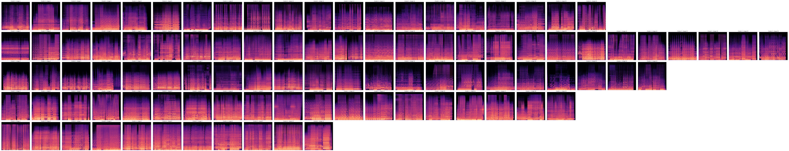

# Music Cluster

> Universal model for clustering music with similar characteristics using MP3 files.

## Table of Contents

* [Introduction](#introduction)
* [Features](#features)
* [Screenshots](#screenshots)
* [Dependencies](#dependencies)
* [Setup](#setup)
* [Usage](#usage)
* [Acknowledgements](#acknowledgements)

## Introduction

- This model is trained on existing music tracks of different types.
- Afterward it can be used to cluster these tracks according to their musical signature.
- So far only tested with MP3 files.

## Features

- Compatible with any music filetype
- Visual spectrograms of music tracks
- Variable cluster count

## Screenshots

 
*Sample clusters of some tracks (one row for each cluster)*

## Dependencies

- [SciKit Learn](https://scikit-learn.org)
- [TensorFlow](https://www.tensorflow.org)
- librosa
- mlflow
- numpy

## Setup

- Use `pip install -r requirements.txt` to install all necessary dependencies.
- Create the empty directories *data*, *samples*.
- Gather MP3 files of the desired tracks and put them in the *samples* directory (each album in its separate
  sub-directory).
- Run the ML-Flow server
  with `mlflow server --host 127.0.0.1 --port 8080 --no-serve-artifacts --backend-store-uri <PATH>` for logging the
  training process.
- If no logging is needed, disable it when creating a model instance at `model = MusicClust_Model(logging=False)`.

## Usage

- Move to the `src` directory.
- Use `python train.py` (sample contained in the file) to train a model with existing MP3 files.
- Use `python cluster.py` (sample contained in the file) to cluster the given samples.

## Acknowledgements

This project was inspired by myself, since there was no suitable alternative.

*Original idea in October 2024*
